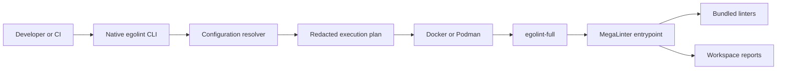

# Architecture

Egolint is an adapter around a versioned lint-engine image, not a reimplementation
of every linter.

## Product boundaries

### Native binary and lightweight image

The Rust binary owns command parsing, deterministic config layering, validation,
runtime selection, safe argv construction, plan/schema/report contracts, and
report bookkeeping. The lightweight `egolint` image contains only this binary
and its runtime libraries.

The alpha CLI always delegates actual lint execution to Docker or Podman. The
lightweight image therefore supports introspection commands but is not a
self-contained lint engine. It deliberately has no Docker CLI and should not be
given a host container socket.

### Full image

`egolint-full` extends the pinned MegaLinter release, copies policy to
`/opt/egolint`, and inherits MegaLinter's entrypoint. The native CLI selects an
embedded profile through `MEGALINTER_CONFIG` and mounts the target repository at
`/tmp/lint`.

This design keeps the CLI independent from MegaLinter implementation details.
A future local adapter may allow the CLI binary inside the full image to invoke
the engine directly, but that capability does not exist in this alpha.

## Extension seams

- Repository TOML chooses runtime behavior, may add non-secret environment, and
  may persist a validated `megalinter-config` path.
- `--megalinter-config` overrides that path for one invocation.
- `--enable-linter` and `--disable-linter` alter canonical MegaLinter IDs for a
  single run.
- New engines should implement a typed adapter behind the execution-plan
  boundary instead of adding shell fragments or engine-specific flags to every
  command.

Host external programs are invoked as an executable plus argv. User data is
never interpolated into a host shell command. The full image deliberately
inherits MegaLinter's internal Bash entrypoint for its trusted engine policy.
